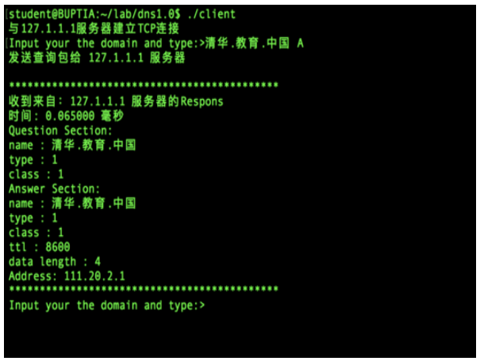

# DNS-Server-Client

## Overview
The requirement of the project is to achieve Chinese domain name resolution based on the DNS (Domain Name System) client/server and a Linux command-line terminal. The purpose of the project is to help us get in-depth understanding of the DNS protocol by combining with previous experimental programming practice.

# Development Environment
Linux environment and C language

# Features
- Realize the resolution of Chinese domain names. The project should support at least 4 top-level domains, and achieve the analysis of third-level domain names.
- Resource Record types include A, MX and CNAME. For MX type, IP address is carried in Additional Section.
- Iterative Resolution method is supported.
- Local server has a cache. The project can print trace records to indicate the process. E.g. query path, server response time.
- Between client and local DNS server, the transport layer is TCP. Between DNS servers, the transport layer is UDP.
- Application layer protocol is DNS, all DNS messages used in the communication process can be correctly parsed by Wireshark.
- The data maintenance mode of the server use the file.
- The program run stably and support error handling, such as invalid command, missing parameters, the same name processing and blank characters.

# Preliminary Design
## Decomposition of Functional Modules
- Divide the tasks into 4 parts:
  - **TCP/UDP Communication**: In the project, TCP communication needs to be used between the client and the Local Server. UDP communication is used between the root side, TLD, 2LD, and the Local Server.
  - **Encode the DNS Packet into Buffer**: When the sender is ready to send a DNS packet, this module will be called to write the contents of the packet into the buffer.
  - **Decode Buffer into DNS Packet**: When the receiver receives data, it needs to use this module to read the data from buffer and construct a DNS packet to store the data.
  - **File Operation**: When the receiver receives data, this module would help read resource records from the database and write resource records to cache.
  
## Relationship and Interface Between the Modules
- The sender will encode DNS packet to buffer and send the data to the receiver by using TCP or UDP communication. The receiver decodes DNS packet from buffer and use the File Operation to query the local database. Local server would have a cache to efficient the process.

## Overall Flow Chart


## Design of data structures
- **DNS Packet Format** (Following the DNS Message Format(from [RFC 1035)](https://tools.ietf.org/html/rfc1035), we design the DNS packet format.)
  - DNS Packet Header
  ```
  struct dns_header{
  uint16_t id;
  uint16_t tag;
  uint16_t queryNum; 
  uint16_t answerNum; 
  uint16_t authorityNum; 
  uint16_t additionNum;
  };
  ```
  - DNS Packet Question
  ```
  struct dns_query{
  char *name; 
  uint16_t qType; 
  uint16_t qClass;
  };
  ```
  - DNS Packet RR
  ```
  //A & CNAME Record struct dns_rr{
  char *name; 
  uint16_t type; 
  uint16_t class; 
  uint32_t ttl; 
  uint16_t data_len; 
  char *Data;
  };
  
  //MX Record
  struct dns_MX_rr{ 
  char *name; 
  uint16_t type; 
  uint16_t class; 
  uint32_t ttl; 
  uint16_t data_len; 
  uint16_t Preference; 
  char *exchange;
  };
  ```
  
# Detailed Design
- **TCP/UDP Communication**  
When performing TCP communication, we should bind the server's IP and socket, and start monitoring. Therefore, there is listen( ) and accept( ). Once a client initiates a connection request, a TCP connection will be established, then it can realize data transmission. The methods are send( ) and receive( ).  
When performing UDP communication, we also should bind the Server’IP and socket, then it is possible to perform data transmission with the client. There is no connection in UDP communication. The methods are sendto( ) and receivefrom( ).

- **Encode the DNS Packet into Buffer**  
In the process of encoding DNS packet into buffer, we need to write some method to put 2 byte or 4 byte char into buffer. Since the domain name is not a fix length, we need to write another method to encode domain name into buffer, also we should write some method to change the format of domain and IP Address so that it can be caught and decoded by Wireshark.  
For example:  
domain: 北邮.教育.中国 à6北邮6教育6中国6 IP: 192.168.100.98 ——> c0a86462

- **Decode Buffer into DNS Packet**  
In the process of decoding buffer into DNS packet, we need to write get2byte or get4byte method to put char into DNS packet. Since the domain name is not the fix length, we need to write another method to decode domain name into DNS packet, there are some methods to change the format of domain and IP Address and they can be understood by user.  
For Example:  
Domain:6北邮6教育6中国0à北邮.教育.中国  
IP: c0a86462 ——> 192.168.100.98

- **File Operation**  
  - File Reading  
  The function is used to get the Resource Record by checking the domain name and type. In the TLD and Root server, it only need to match the Second Level Domain or Top Level Domain, so we have to write a method to split the domain name.  
  For Example:  
  In the Root server: 北邮.教育.中国 à 中国  
  In the TLD server: 北邮.教育.中国 à 教育.中国
  
  - File Writing
  The function is used to write the resource record into the cache of the Local Server’ when get the correct record.
  
# Demo(Trace and Display Time in Command Line (A, CNAME, MX record))
- **A Record**  
When you enter value that domain name is “清华.教育.中国” and query type is “A”, system will give you the IP of the domain name. And the trace of querying will be printed on Local Server.


  
- **CNAME Record**  
When you enter value that domain name is “清华.教育.中国” and query type is “CNAME”, system will give you the Primary Name of the domain name. And the trace of querying will be printed on Local Server.  


- **MX Record**  
When you enter value that domain name is “清华.教育.中国” and query type is “MX”, system will give you the IP of the Mail Server of the domain name. And the trace of querying will be printed on Local Server.


# How to Run
- Using a virtual machine to open 7 Linux system
- Run the 7 servers on different machines
- Enter specific parameter on the client, then get query response
